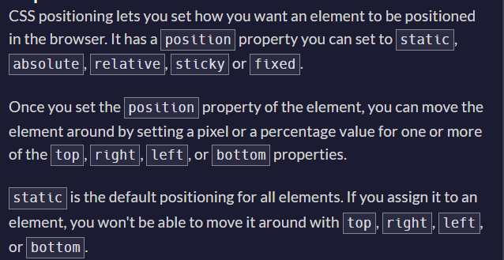
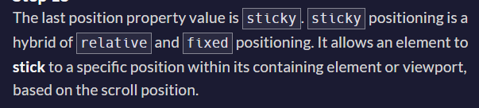
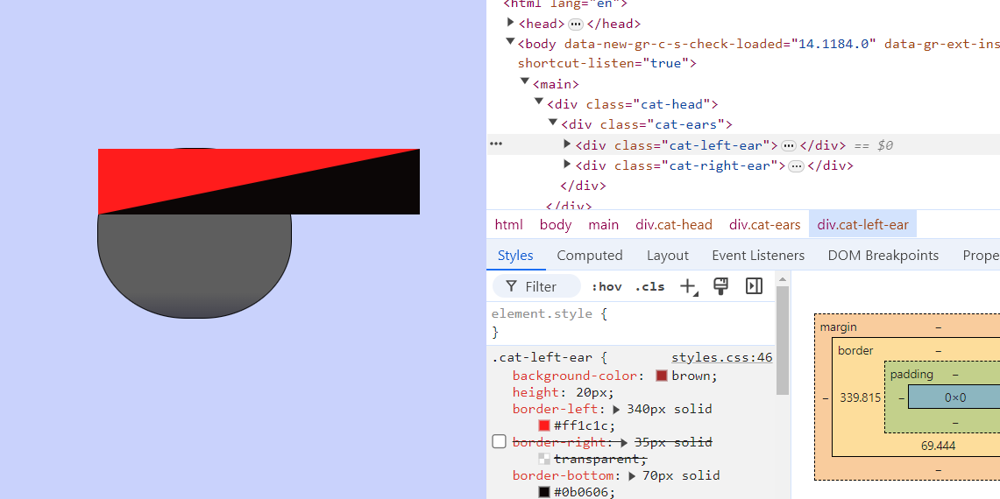
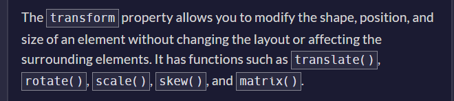
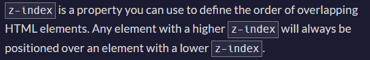

- one div is sticky and other is something else like absolute, see the differnce in scrolling behaviour, ask senior deb about this on discord.
To create a linear gradient background with `#5e5e5e` at 85% and `#45454f` at 100%, you can use the following CSS code:

```css
background: linear-gradient(to bottom, #5e5e5e 85%, #45454f 100%);
```

Here's how you can apply it to an HTML element:

```html
<!DOCTYPE html>
<html lang="en">
<head>
    <meta charset="UTF-8">
    <meta name="viewport" content="width=device-width, initial-scale=1.0">
    <style>
        body {
            background: linear-gradient(to bottom, #5e5e5e 85%, #45454f 100%);
            height: 100vh;
            margin: 0;
            display: flex;
            justify-content: center;
            align-items: center;
            color: white;
            font-family: Arial, sans-serif;
        }
    </style>
    <title>Linear Gradient Background</title>
</head>
<body>
    <h1>Linear Gradient Background</h1>
</body>
</html>
```

This will create a vertical linear gradient background that transitions from `#5e5e5e` at 85% of the height to `#45454f` at 100% of the height of the element (in this case, the entire body of the page).

why such behaviour?




