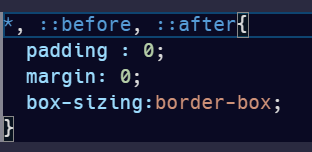
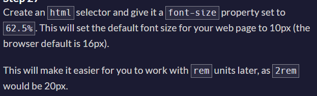
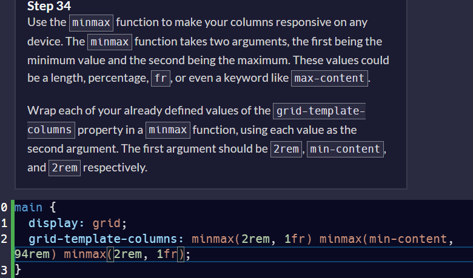
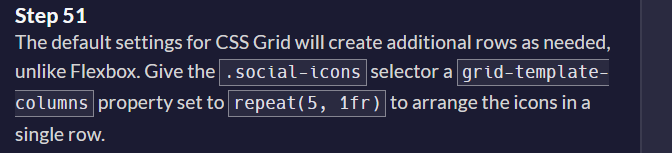
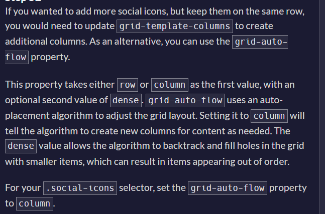
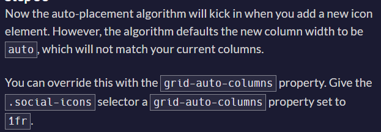
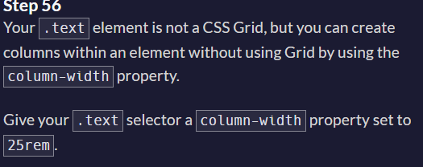
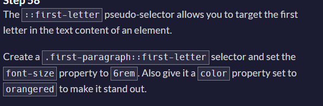
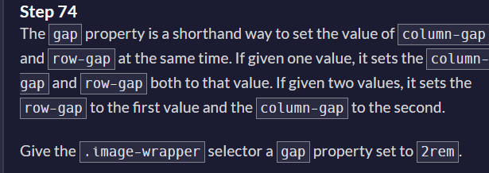
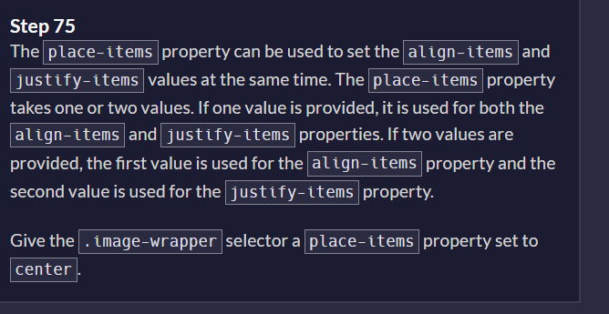

- loading attribute on an img element

- what does target attribute in a element do? 

i element and use of fontawesome icons
- blockquote element

- aside element
- what does ::before and ::after doing here?

- browser default font size - 16px

- what does minmax function do in grid;

- object fit in css(cover, contain, etc)

- grid-auto-flow

- grid-auto-columns

- column-width property

- list-style-type for list element
- gap for grid

- place-items in grid
