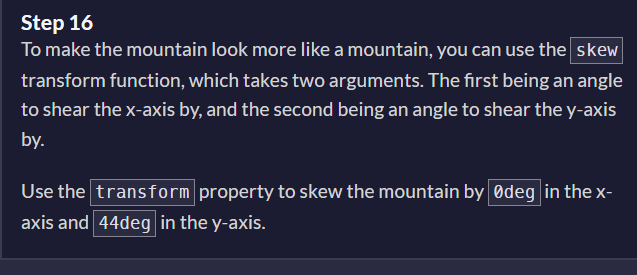
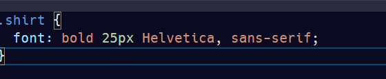
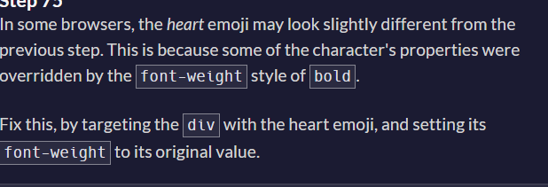

- skew transform function

- by default if we position the element as absolute,it will position itself on the bottom?? how? check out other cases.
- you can write the font as follows too


- initial as property value in css to set the original value;
- cursor:not-allowed in css
- animation shorthand property: time, iteration, timing function, and animation name
- transition in css
```
/* Apply to 1 property */
/* property name | duration */
transition: margin-right 4s;

/* property name | duration | delay */
transition: margin-right 4s 1s;

/* property name | duration | easing function */
transition: margin-right 4s ease-in-out;

/* property name | duration | easing function | delay */
transition: margin-right 4s ease-in-out 1s;

/* property name | duration | behavior */
transition: display 4s allow-discrete;

/* Apply to 2 properties */
transition:
  margin-right 4s,
  color 1s;

/* Apply to all changed properties */
transition: all 0.5s ease-out allow-discrete;
transition: 200ms linear 50ms;

/* Global values */
transition: inherit;
transition: initial;
transition: revert;
transition: revert-layer;
transition: unset;

```