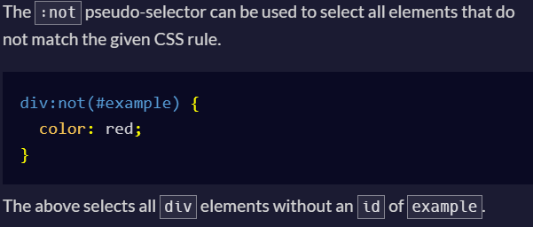

## Remember this
Remember that fonts with spaces in the name must be wrapped in quotes for CSS.Example 
```"Open Sans", sans-serif```




when there is space between the word in p tag due to another tags like <i> or <span>, try to nest them together with <span> tag.

