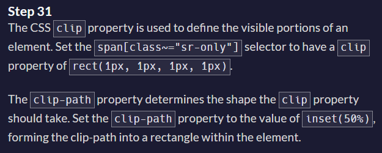
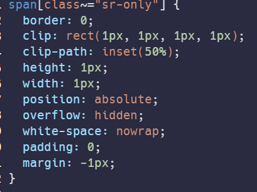
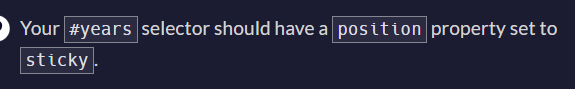
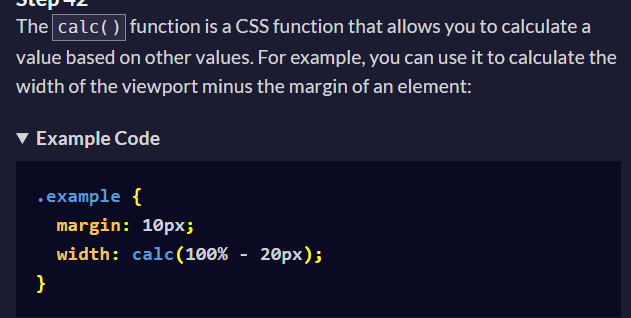
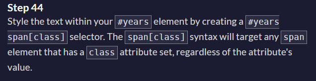
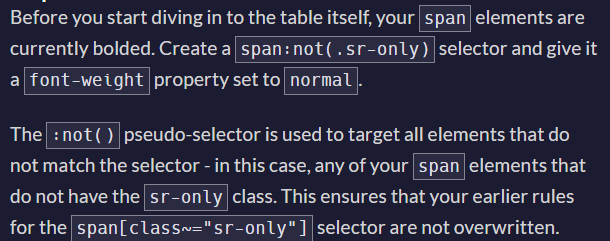
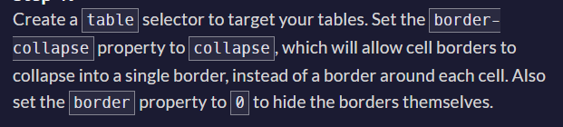
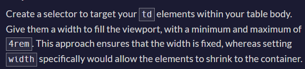
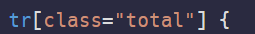
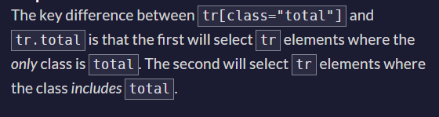

- Recall what does this attributes does? 
- aria-hidden="true"
- caption and caption-side
- table, tr, th, td elements
- span[class~="sr-only"], what does ~= symbol do? 
No, the selector `span[class="sr-only"]` will not behave the same as `span[class~="sr-only"]`. Let's look at the difference between the two:

### `span[class="sr-only"]`

This selector matches only `<span>` elements whose `class` attribute is exactly equal to "sr-only". It will not match elements that have additional classes. For example, it will match:

```html
<span class="sr-only">...</span>
```

But it will **not** match:

```html
<span class="text sr-only">...</span>  <!-- Not matched -->
<span class="sr-only highlight">...</span>  <!-- Not matched -->
```

### `span[class~="sr-only"]`

This selector matches `<span>` elements whose `class` attribute contains the word "sr-only" in a space-separated list of words. It will match any `<span>` element that includes "sr-only" among its classes. For example, it will match:

```html
<span class="sr-only">...</span>
<span class="text sr-only">...</span>
<span class="sr-only highlight">...</span>
```

### Summary

- `span[class="sr-only"]` matches only if the class attribute is exactly "sr-only".
- `span[class~="sr-only"]` matches if the class attribute includes "sr-only" as one of the space-separated classes.

If you want to select elements that have "sr-only" as one of their classes, use `span[class~="sr-only"]`. If you want to select elements that have only the class "sr-only" and no other classes, use `span[class="sr-only"]`.
 - clip: rect(1px, 1px, 1px, 1px);
 - clip-path: inset(50%)


- gap property for flex;
- :first-of-type pseudo selector
- :last-of-type pseudo selector


- z-index;


- !important attribute:
The !important rule in CSS is used to add more importance to a property/value than normal.In fact, if you use the !important rule, it will override ALL previous styling rules for that specific property on that element!





In the CSS linear-gradient function, the value `1.845rem` plays a crucial role in defining where the transition between colors occurs. Let's break down the syntax and the role of `1.845rem` in your gradient:

```css
linear-gradient(180deg, #dfdfe2 1.845rem, white 1.845rem)
```

- `180deg`: This specifies the direction of the gradient. `180deg` means the gradient moves from top to bottom.
- `#dfdfe2 1.845rem`: This specifies that the color `#dfdfe2` is applied from the start (0%) to `1.845rem` from the top.
- `white 1.845rem`: This specifies that the color `white` starts exactly at `1.845rem` from the top.

In essence, the value `1.845rem` is a measurement that determines the point at which the gradient transitions from `#dfdfe2` to `white`. Since both color stops (`#dfdfe2` and `white`) are specified at `1.845rem`, the gradient will show a sharp transition between these two colors at that position. The area from the top to `1.845rem` will be filled with `#dfdfe2`, and from `1.845rem` downward, it will be filled with `white`.

This creates a sudden color change rather than a gradual blending between `#dfdfe2` and `white`.

- vertical-align property
- 
